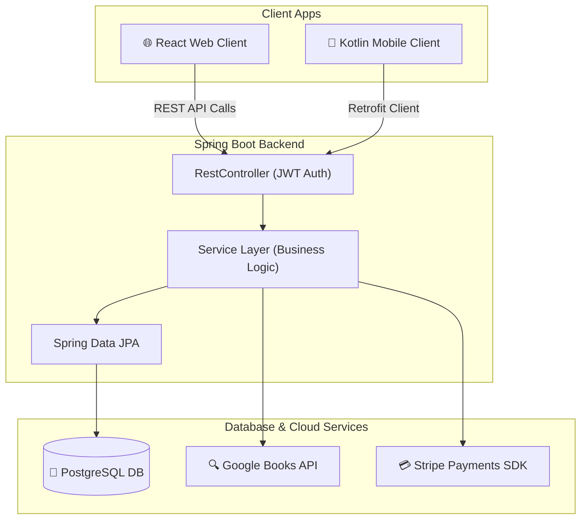

# 📚 BookBud — Full-Stack Book Sharing, Selling & Rental Marketplace

**BookBud** is a modern, premium full-stack platform designed to foster a vibrant community marketplace for book sharing, renting, and selling. The ecosystem consists of three major components:
1. **Spring Boot Backend API**: Secure REST API, PostgreSQL database integrations, Stripe payment workflows, and Google Books ISBN lookups.
2. **React Web Application**: Responsive web client with immersive layouts, complete book listing management, browse/explore capabilities, and Stripe checkouts.
3. **Kotlin Android Application**: Native mobile app with premium dynamic dashboards, live Stripe financial summaries, profile setups, and unified ISBN auto-fill forms.

---

## 🏗️ High-Level Project Architecture



---

## ⚡ Core Ecosystem Features

### 🔐 1. Authentication & Session Management
* **Dual Auth Modes**: Implements secure custom username/password flows alongside fully integrated **Google Sign-In**.
* **JWT Token Security**: Access and refresh tokens are securely persisted in `LocalStorage` (web) and local encrypted keychains using `PreferencesManager` (mobile). Includes automatic token expiration and sign-out cleanup.

### 📚 2. Listings & Dynamic Book Catalog
* **Complete Book CRUD**: Users can list books with details including:
  - Title, Author, Genre, Physical Condition, and Description.
  - Custom Cover Image uploads.
* **Flexible Pricing Systems**: Support for three transaction modes:
  - 📖 **Rent Only**: Set rental price per day (PHP/day).
  - 🛒 **Sale Only**: Set a fixed sale price (PHP).
  - 🔄 **Both**: Offer both choices to buyers/renters.
* **Smart Filter & Search**: Interactive query controls to filter listings by genre, condition, transaction type, title, or author.

### 🔍 3. Google Books ISBN Auto-Fill (Features Parity)
* **Outbound Lookup Pipeline**: Allows listing creators to enter a 10 or 13-digit physical ISBN code (e.g. `9780747532699`).
* **Instant Auto-Population**: Tapping the **Auto-Fill** button makes an async call to `/api/v1/books/search-external?q={isbn}`. The backend communicates directly with the **Google Books API** to retrieve, parse, and auto-populate:
  - Book Title & Author list.
  - Publisher Description.
  - Category / Genre mappings.

### 💳 4. Live Payouts & Stripe Payment Workflows
* **Secure Checkout**: Connects securely to the **Stripe Payment Gateway**.
* **Earnings Analytics**: An interactive dashboard showing:
  - **Total Earnings**: Cumulative cleared payouts.
  - **Pending Payouts**: Deposits awaiting completion.
  - **Successful Payouts**: Completed transactions logs.
* **Real-time Balance Feeds**: Dynamically lists all receipt ledger items with color-coded status badges (Forest green for Completed, theme orange for Processing/Pending).

### 📑 5. Transaction Logs & Interactive Peer Feedback
* **Action Logs**: Records transaction statuses like `PENDING`, `ACTIVE` (e.g., active rental period), `COMPLETED`, or `CANCELLED`.
* **Dynamic Rental Clock**: Monitors rental status timers.
* **Peer Reviews**: Users can submit star ratings and feedback upon successful transaction wrap-ups.

### 🔔 6. Real-Time Action Notifications
* Action-based alerts (new list published, payout cleared, peer feedback posted) are stored in notifications logs with instant unread count updates.

---

## 📁 Repository Directory Structure

```text
IT342-Colo-BookBud/
├── backend/            # Spring Boot REST API
│   ├── bookbud/
│   │   ├── src/main/java/edu/cit/colo/bookbud/
│   │   │   ├── features/  # Feature domains (books, auth, payments, transactions, users)
│   │   │   ├── shared/    # Configuration, JWT Security, Stripe Setup
│   │   └── pom.xml        # Maven Dependency Manager
├── web/                # ReactJS Web Client
│   ├── bookbud/
│   │   ├── src/           # State, Components, Views
│   │   └── package.json   # Node Package Manager
└── mobile/             # Kotlin Android Client
    └── BookBud/
        ├── app/src/main/java/com/example/bookbud/
        │   ├── features/  # Native Presentation Fragments (Home, Payments, Profile, Listings)
        │   └── shared/    # Retrofit, Network Client, Models, Preferences
        └── build.gradle   # Android Gradle dependencies
```

---

## 🛠️ Step-by-Step Setup Guide

### ☕ 1. Running the Spring Boot Backend API
#### Prerequisites
* **Java SDK 17** (or above) installed.
* **PostgreSQL** installed and running locally.
* **Maven** configured.

#### Setup Database
Create a database named `bookbud` in your PostgreSQL command line:
```sql
CREATE DATABASE bookbud;
```

#### Configure Environment Variables
Inside [backend/bookbud/src/main/resources/application.properties](file:///c:/Users/Nicoj/OneDrive/Desktop/IT342-Colo-BookBud/backend/bookbud/src/main/resources/application.properties), configure your credentials:
```properties
spring.datasource.url=jdbc:postgresql://localhost:5405/bookbud
spring.datasource.username=postgres
spring.datasource.password=yourpassword

# JWT secret configuration
jwt.secret=your_super_secret_jwt_key_here

# Stripe Integration Credentials
stripe.api.key=sk_test_...
```

#### Build and Launch Backend
```bash
cd backend/bookbud
mvn clean install
mvn spring-boot:run
```
The server will boot up and bind securely to `http://localhost:8080/`.

---

### 🌐 2. Running the React Web Client
#### Prerequisites
* **Node.js** (v16+ recommended).
* **NPM** installed.

#### Install & Start
```bash
cd web/bookbud
npm install
npm start
```
The browser will automatically open the app at `http://localhost:3000/`.

---

### 📱 3. Running/Building the Kotlin Android Mobile App
#### Prerequisites
* **Android Studio** installed.
* **JDK 17** selected as the Gradle compiler JDK.
* **Android Emulator** or physical debugging device with Developer Mode active.

#### Compile the App
To clean check-compile the mobile code and ensure zero syntax/DI graph warnings:
```powershell
cd mobile/BookBud
.\gradlew.bat compileDebugSources --no-daemon
```
To build and install the debug APK to your connected emulator:
```powershell
.\gradlew.bat installDebug
```

---

## 🛡️ Engineering Quality & Parity

BookBud has been engineered following strict enterprise design paradigms:
1. **Dynamic Handoff Interfaces**: Mobile lists do not use hardcoded sizes; scroll layouts dynamically populate programmatically created linear templates, preventing out-of-memory overhead and view container cast failures.
2. **Coroutines Concurrency**: All network I/O calls on Android use modern `Dispatchers.IO` thread delegation via Kotlin's high-performance `async`/`await` block to maintain a continuous 60fps frame budget.
3. **DI Integrity**: Clean, isolated Dagger-Hilt container scopes prevent duplicate initialization warnings and dependency leakage.
4. **Stripe & Security Parity**: Cryptographic JWT validation protects each transaction endpoint.
